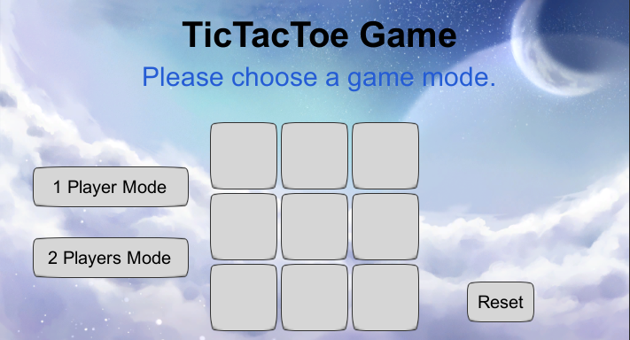
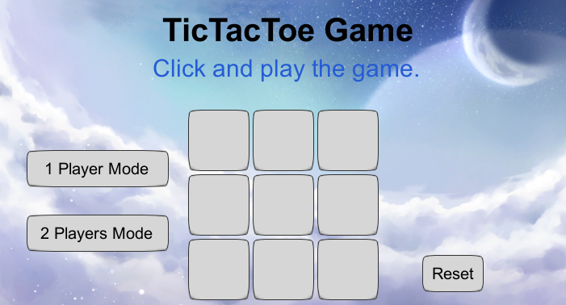
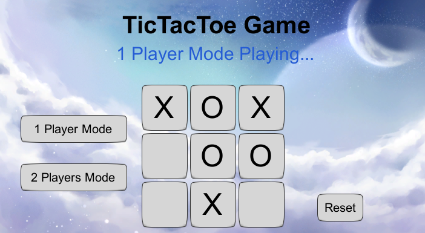
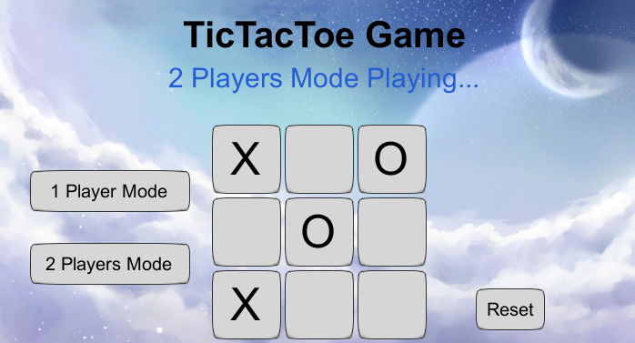
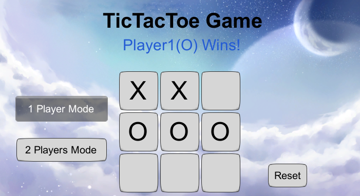
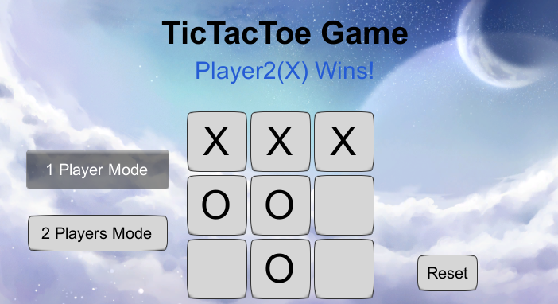
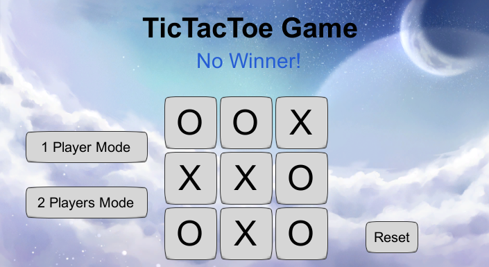

# 项目文档

## 项目基本信息

### 项目名称

井字棋游戏 TicTacToe

### 项目配置

#### 环境配置

+ Unity Hub版本：2.3.2
+ Unity版本：2020.1.0f1
+ Unity界面屏幕大小：710 x 389
+ 语言：C#
+ 操作系统：Win10
+ 编辑器：Visual Stdio Code

#### 游戏配置

1. 首先用Unity Hub打开一个新项目
2. 将`Assets`文件夹中的`background.jpg`、`gameSkin.guiskin`、`TicTacToe.cs`拖动到下方“项目视图”中，作为项目中`Assets`的一部分
3. 然后创建一个空的GameObject，将`TicTacToe.cs`拖动到其上，并点击它
4. 接着将“项目视图”中`Assets`的图片`background`拖到右侧“属性视图”的`backgroundImage`中，将文件`gameSkin`拖到右侧“属性视图”的`gameSkin`中
5. 最后点击Play按钮即可运行（配置步骤可见视频）

### 项目实现过程和算法

按照要求，需要实现数据、逻辑、交互与呈现的分离。

首先定义游戏数据部分，由控制棋格状态的常量、控制游戏过程的变量、棋格布局设置静态变量和界面设计变量四个部分组成，其中控制棋格状态的常量、控制游戏过程的变量这部分数据用于逻辑，棋格布局设置静态变量和界面设计变量这部分数据用于交互和呈现，实现了数据、逻辑、交互与呈现三者的分离和互相联系。

```C#
/* 井字棋中每一个棋格中的逻辑控制常量，代表这个棋格的状态 */
private const int NOPLAYER = 0;  // 0代表这个棋格没有玩家
private const int PLAYER1 = 1;  // 1代表玩家1占据这个棋格
private const int PLAYER2 = 2;  // 2代表玩家2占据这个棋格

/* 整个游戏需要用到的逻辑控制变量 */
private int gameTurn = PLAYER1;  // 游戏回合，PLAYER1代表这个游戏回合是玩家1的，PLAYER2代表是玩家2的回合
private int totalMoves = 0;  // 两个玩家总共进行的回合数
private int totalPlayer = 0;  // 游戏的玩家数，0代表还未选择游戏模式，1代表与电脑进行对决，2代表双人游戏
private int [,] chessBoard = new int [3, 3];  // 井字棋盘

/* 井字棋棋格的布局设置 */
private static int buttonWidth = 80;  // 每个棋格的宽度
private static int buttonHeight = 80;  // 每个棋格的高度
// 井字棋中最左上角第一个棋格的横坐标位置 
private static int firstButtonX = (Screen.width - 3 * GUIInterface.buttonWidth) / 2;
// 井字棋中最左上角第一个棋格的纵坐标位置 
private static int firstButtonY = Screen.height - 3 * GUIInterface.buttonHeight - 10;

/* 游戏界面设计用到的变量 */
public Texture2D backgroundImage;  // 游戏背景图片
public GUISkin gameSkin;  // 游戏控件的皮肤风格
```

接着游戏所使用的方法如下：

```C#
/* 用游戏的玩家数初始化游戏 */
void InitGameWithTotalPlayer(int playersNum);
/* 单人游戏模式中电脑的移动 */
void ComputerMove();
/* 检查是否有赢家 */
int CheckWinner();
/* 添加游戏背景 */
void AddBackground();
/* 添加游戏标题 */
void AddTitle();
/* 添加提示框 */
void AddTip();
/* 添加按钮实现的井字棋格和功能按钮 */
void AddButton();
/* 添加井字棋格 */
void AddGameButton();
/* 添加重置按钮 */
void AddResetButton();
/* 添加游戏模式选择按钮 */
void AddChooseGameModeButton();
/* 根据是否有赢家获得提示框中的内容 */
string GetTipText();
/* 根据横坐标和纵坐标获取棋盘相应位置从而获取井字棋格内容 */
string GetGameButtonText(int xIndex, int yIndex);
/* 根据横坐标和纵坐标获取棋盘相应位置从而设置相应棋格功能 */
void SetGameButtonFunction(int xIndex, int yIndex);
/* 进行游戏 */
void PlayGameSystem();
```

其中`InitGame()`、`ComputerMove()`、`CheckWinner()`、`GetTipText()`、`GetGameButtonText(int xIndex, int yIndex)`、`SetGameButtonFunction(int xIndex, int yIndex)`六个方法与逻辑有关。

方法名前有Add的`AddBackground()`、`AddTitle()`、`AddTip()`、`AddButton()`、`AddGameButton()`、`AddResetButton()`、`AddChooseGameModeButton()`七个方法与交互和呈现有关。

在这些Add方法中：

`AddBackground()`、`AddTitle()`只是简单地添加背景和标题，与逻辑没关系；

`AddTip()`添加提示框时需要使用`GetTipText()`方法作为逻辑控制，获取显示内容，在`GetTipText()`方法中，首先使用`CheckWinner()`方法检查是否有赢家，然后根据返回结果以及数据部分中`totalPlayer`玩家数和`totalMoves`总回合数这些相应数据确定提示框中的显示内容；

`AddButton()`中由`AddGameButton()`、`AddResetButton()`、`AddChooseGameModeButton()`三个方法组成，其中`AddGameButton()`使用`string GetGameButtonText(int xIndex, int yIndex)`和`SetGameButtonFunction(int xIndex, int yIndex)`作为逻辑控制，根据数据部分中`chessBoard`对应位置的棋格状态显示不同的棋格内容；`AddResetButton()`使用`InitGameWithTotalPlayer(int playersNum)`方法作为逻辑控制，按下重置键后，直接初始化游戏；`AddChooseGameModeButton()`使用`InitGameWithTotalPlayer(int playersNum)`方法作为逻辑控制，点击其中一个游戏模式选择按键后，游戏被初始化，同时数据部分的`totalPlayer`游戏玩家人数变为相应数值。

最后在`PlayGameSystem()`方法中，只有`AddBackground()`、`AddTitle()`、`AddTip()`、`AddButton()`四个方法，

#### 重要的实现细节

在添加棋格中，所使用到的比较重要的算法是`GetGameButtonText(int xIndex, int yIndex)`和`SetGameButtonFunction(int xIndex, int yIndex)`，它们根据棋盘不同的横纵下标对应的`chessBoard`数据部分中的内容，添加不同的棋格内容和功能，具体实现如下：

```C#
/* 根据横坐标和纵坐标获取棋盘相应位置从而获取井字棋格内容 */
string GetGameButtonText(int xIndex, int yIndex) {
    // 按照横纵坐标找到棋格相应的位置
    int buttonX = firstButtonX + xIndex * buttonWidth;
    int buttonY = firstButtonY + yIndex * buttonHeight;
    // 获取对应坐标中棋格的信息
    int Player = chessBoard[yIndex, xIndex];
    switch (Player) {
        // 如果这个棋格中为NOPLAYER
        case NOPLAYER:
            // 设置按钮中不显示任何内容
            return "";
        // 如果这个棋格中为PLAYER1
        case PLAYER1:
            // 棋格中显示内容为O
            return "O";
        // 如果这个棋格中为PLAYER2
        case PLAYER2:
            return "X";
        default:
            // 棋格中显示内容为X
            return "";
    }
}

/* 根据横坐标和纵坐标获取棋盘相应位置从而设置相应棋格功能 */
void SetGameButtonFunction(int xIndex, int yIndex) {
    int Player = chessBoard[yIndex, xIndex];
    switch (Player) {
        // 如果这个棋格中为NOPLAYER
        case NOPLAYER:
            // 如果还未选择游戏模式，那么进行提示，且点击按钮无反应
            if (totalPlayer == 0) {
                return;
            }
            // 选择游戏模式并点击棋格后，该棋格设置为这个游戏回合对应的玩家，游戏回合转换，总回合数加一
            chessBoard[yIndex, xIndex] = gameTurn;
            gameTurn = (gameTurn == PLAYER1 ? PLAYER2 : PLAYER1);
            totalMoves++;
            // 如果是单人游戏模式且游戏还未结束，那么电脑直接来走一步
            if (totalPlayer == 1 && totalMoves < 9 && CheckWinner() == NOPLAYER) {
                ComputerMove();
            }
            break;
        // 如果这个棋格中为PLAYER1，无反应
        case PLAYER1:
            break;
        // 如果这个棋格中为PLAYER2，无反应
        case PLAYER2:
            break;
    }
}
```

而在进行游戏时，要对是否有赢家进行检查，一个比较重要的算法就是检查是否有赢家的`CheckWinner()`方法，根据`chessBoard`中各个棋格的状态，进行判断，如果没有赢家，返回0，具体实现如下：

```C#
/* 检查是否有赢家 */
int CheckWinner() {
    // 一共有8种赢的情况，首先检查3行3列的6种赢的情况
    for (int i = 0; i < 3; ++i) {
        if (chessBoard[i, 0] != NOPLAYER && 
            chessBoard[i, 0] == chessBoard[i, 1] && 
            chessBoard[i, 1] == chessBoard[i, 2]) {
            // 有玩家胜出，那么游戏回合置为NOPLAYER，返回这个玩家对应的值，1代表玩家1，2代表玩家2
            gameTurn = NOPLAYER;
            return chessBoard[i, 0];
        }
        if (chessBoard[0, i] != NOPLAYER && 
            chessBoard[0, i] == chessBoard[1, i] && 
            chessBoard[1, i] == chessBoard[2, i]) {
            gameTurn = NOPLAYER;
            return chessBoard[0, i];
        }
    }
    // 检查对角线的2种赢的情况
    if (chessBoard[1, 1] != NOPLAYER) {
        if ((chessBoard[0, 0] == chessBoard[1, 1] && 
            chessBoard[1, 1] == chessBoard[2, 2]) || 
            (chessBoard[0, 2] == chessBoard[1, 1] && 
            chessBoard[1, 1] == chessBoard[2, 0])) {
            gameTurn = NOPLAYER;
            return chessBoard[1, 1];
        }
    }
    // 没人胜出，那么返回NOPLAYER，代表没有赢家
    return NOPLAYER;
}
```

在添加提示框中，所使用到的比较重要的算法是`GetTipText()`，其根据当前是否有赢家，添加出不同的提示框内容，具体实现如下：

```C#
/* 根据是否有赢家获得提示框中的内容 */
string GetTipText() {
    // 检查是否有赢家
    int winner = CheckWinner();
    switch (winner) {
        // 如果没有赢家
        case NOPLAYER:
            // 如果总玩家数为0，即还未选择游戏模式，那么提示选择游戏模式
            if (totalPlayer == 0) {
                return "Please choose a game mode.";
            } else if (totalMoves == 0) {  // 如果总回合数为0，说明还未开始游戏，提示点击棋格并进行游戏
                return "Click and play the game.";
            } else if (totalMoves == 9) {  // 如果总回合数为9，说明游戏结束且无玩家胜出，提示没有赢家
                return "No Winner!";
            } else {
                // 如果是单人模式且游戏正在进行，提醒正在进行单人游戏模式
                if (totalPlayer == 1) {
                    return "1 Player Mode Playing...";
                } else if (totalPlayer == 2) {  // 如果是双人模式且游戏正在进行，提醒正在进行双人游戏模式
                    return "2 Players Mode Playing...";
                }
                return "";
            }
        // 如果玩家1胜出
        case PLAYER1:
            // 提示框显示玩家1胜出
            return "Player1(O) Wins!";
        // 如果玩家2胜出
        case PLAYER2:
            // 提示框显示玩家2胜出
            return "Player2(X) Wins!";
        default:
            return "";
    }
}
```

### 效果截图

刚打开游戏时，提示选择游戏模式，不然点击棋格无反应，界面效果：



选择了一个游戏模式或进行游戏后点击Reset，棋盘被初始化，提示点击棋格进行游戏：



选择了单人游戏模式，进行游戏过程中，提示正在进行单人游戏模式：



选择了双人游戏模式，进行游戏过程中，提示正在进行双人游戏模式：



玩家1胜出：



玩家2胜出：



打成平局：


