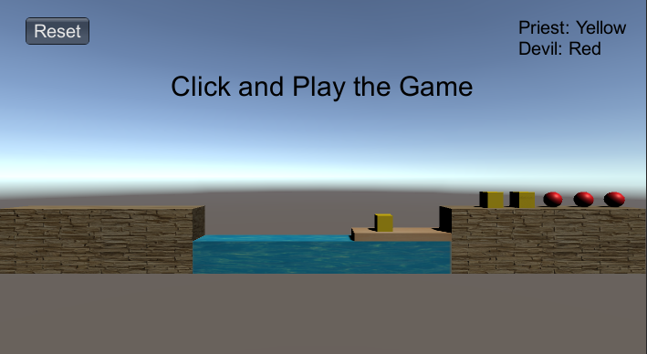
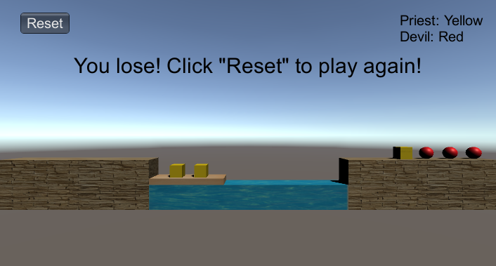
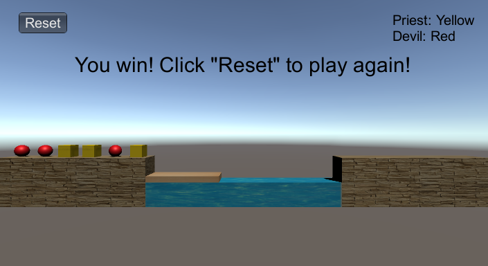

# 项目文档

## 项目基本信息

### 项目名称

牧师与魔鬼游戏 PriestsAndDevils

### 项目配置

#### 环境配置

+ Unity Hub版本：2.3.2
+ Unity版本：2020.1.0f1
+ Unity界面屏幕大小：710 x 389
+ 语言：C#
+ 操作系统：Win10
+ 编辑器：Visual Stdio Code

#### 项目配置过程

将`Assets`文件夹中覆盖创建的新项目的`Assets`文件夹，再点击Play按钮即可运行

### 项目实现过程

按照要求，需要满足ECS规则和使用MVC模式，实现模型、视图、控制器的模式开发，所以首先创建三个文件，分别为`Model.cs`、`View.cs`、`Controller.cs`，在这三个文件中分别实现有关模型、视图和控制器，使其同在一个命名空间内，从而实现联系，最后创建一个`Main.cs`文件，在这个文件中调用主控制器，从而进行游戏，实现MVC模式。

### 模块介绍

整个项目分为模型、视图、控制器三个部分，模型部分用到的类有：`BoatModel`、`ShoreModel`、`RoleModel`、`MoveModel`，分别是船模型，岸模型，角色（牧师与魔鬼）模型和移动模型；

视图部分用到的类有：`BoatView`、`ShoreView`、`RoleView`、`MoveView`、`RiverView`、`FunctionView`，分别代表船视图、岸视图、角色视图、移动视图、河流视图和功能视图；

控制器部分用到的类有：`BoatController`、`ShoreController`、`RoleController`、`MoveController`、`ClickController`、`MainController`、`SingleObject`。

**1、模型部分**

模型部分中的类只定义了一些关键属性，以及它们的构造函数、getter和setter方法，相关逻辑对其属性的修改由控制器传递相关参数完成，模型部分中没有出现逻辑语句，实现了模型部分的独立。

**2、视图部分**

视图部分的类中船视图`BoatView`、岸视图`ShoreView`、角色视图`RoleView`、河流视图`RiverView`都有一个GameObject类型的对象，负责使用`Instantiate`方法动态创建相应的游戏对象在界面中显示；

移动视图`MoveView`中只有一个`MoveTo`函数，有一个`Vector3.MoveTowards`方法，负责接收控制器的指令，从而将一个物体以一定速度移到一个位置，并在界面中显示出来；

功能视图`FunctionView`只有一个`tipContent`成员变量，负责接收控制器传来的内容，在`OnGUI()`函数中渲染相应提示框并显示内容，还有渲染一个Reset按钮，其中用到的初始化`InitGame()`函数也来自控制器。

像`Instantiate`方法和`OnGUI()`函数这些渲染界面所用的东西只在视图部分出现，且这些方法中都没有`if`或`switch`等逻辑部分，模型部分和控制器部分都没有出现过渲染界面所用到的这些东西，实现了视图部分的独立。

**3、控制器部分**

控制器部分中，`BoatController`船控制器、`ShoreController`岸控制器、`RoleController`角色控制器、`MoveController`移动控制器都有相应的模型和视图类作为成员变量，从而控制相应的模型参数和视图显示的变化；

`ClickController`是点击控制器，一般会挂载到具体的游戏对象上，从而实现对象点击后的行为，`MoveController`也一般会挂载到具体的游戏对象上，从而实现对象相应的移动行为；

`MainController`是主控制器，用来控制整个游戏，其中包含了所有具体的游戏角色对应的控制器，比如船控制器、左岸控制器、右岸控制器、以及所有角色的6个控制器；

其中还直接包含了河流视图和功能视图，因为河流视图可以直接进行界面渲染，没有逻辑，功能视图的接收逻辑与整个游戏有关，所以这两个视图都没有设计专门的模型和控制器，相关逻辑直接在主控制器中实现。

主控制器中还有一个游戏状态的的变量`gameState`，用来表示游戏状态，从而实现相应的功能和显示内容。

`SingleObject`是单例对象，里面有唯一一个主控制类，用来使其它类能获取主控制类的唯一实例从而向主控制类传递信息，完成相应逻辑。

### 核心算法

在船模型和岸模型中，分别设置了两个`string []`类型的变量`roleOnBoat`和`roleOnShore`，代表在船上和在岸上的角色（牧师与魔鬼）的情况，因为创建角色游戏对象时，以角色类型和序号进行命名，比如"Priest1"、"Priest2"、"Devils1"这样写，那么6个角色游戏对象就有6个不同的名字字符串，将这些名字填入表示船上情况或岸上情况的字符串数组，没有角色则字符串为空，那么就可以表示船上或岸上的角色情况。

在船控制器和岸控制器中，分别有`PutRoleOnBoat(string roleName)`、`PutRoleOffBoat(string roleName)`和`PutRoleOnShore(string roleName)`、`PutRoleOffShore(string roleName)`四个方法，在对象移动后，来对船上或岸上存放对象的数组进行调整，从而表示在船上或在岸上的对象的情况，最后使用getter方法获取这两个数组就可以实现判断游戏状态的逻辑：

```C#
/* 将角色放到船上 */
public void PutRoleOnBoat(string roleName) {
    // 获取船上空闲位置
    int freeIndex = GetFreeIndex();
    // 如果没有空闲位置，直接返回
    if (freeIndex < 0) {
        return;
    }
    // 利用角色名字将角色放入船
    string [] roleOnBoat = boatModel.GetRoleOnBoat();
    roleOnBoat[freeIndex] = roleName;
}

/* 将角色离开船上 */
public void PutRoleOffBoat(string roleName) {
    string [] roleOnBoat = boatModel.GetRoleOnBoat();
    // 如果船的相应位置有角色名字，将其置为空
    for (int i = 0; i < roleOnBoat.Length; i++) {
        if (roleOnBoat[i] == roleName) {
            roleOnBoat [i] = "";
            break;
        }
    }
}

/* 将角色放到岸上 */
public void PutRoleOnShore(string roleName) {
    // 获取岸上空闲位置
    int freeIndex = GetFreeIndex();
    // 如果没有空闲位置，直接返回
    if (freeIndex < 0) {
        return;
    }
    // 利用角色名字将角色放上岸
    string [] roleOnShore = shoreModel.GetRoleOnShore();
    roleOnShore[freeIndex] = roleName;
}

/* 将角色离开岸上 */
public void PutRoleOffShore(string roleName) {	// 0->priest, 1->devil
    string [] roleOnShore = shoreModel.GetRoleOnShore();
    // 如果岸的相应位置有角色名字，将其置为空
    for (int i = 0; i < roleOnShore.Length; i++) {
        if (roleOnShore[i] == roleName) {
            roleOnShore [i] = "";
            break;
        }
    }
}
```

判断游戏状态逻辑的函数在主控制器中，主控制器中有船和左右的岸的控制器，可以获取它们的角色数组情况，从而判断状态，为：

```C#
/* 检查游戏状态 */
public int CheckGameState() {
    // 初始化左边和右边的牧师和魔鬼数量都为0
    int leftPriest = 0, rightPriest = 0;
    int leftDevil = 0, rightDevil = 0;

    // 获取左岸和右岸以及船上的牧师和魔鬼的数量数组
    int [] leftShoreCount = leftShore.GetRoleCountOnShore();
    int [] rightShoreCount = rightShore.GetRoleCountOnShore();
    int [] boatCount = boat.GetRoleCountOnBoat();

    // 如果船在左边，那么左边的牧师和魔鬼的数量为左岸数量加上船里的数量
    if (boat.GetBoatSide() == (int)ShoreSide.Left) {
        leftPriest = leftShoreCount[0] + boatCount[0];
        leftDevil = leftShoreCount[1] + boatCount[1];
        rightPriest = rightShoreCount[0];
        rightDevil = rightShoreCount[1]; 
    } else {
        // 如果船在右边，那么右边的牧师和魔鬼的数量为右岸数量加上船里的数量
        leftPriest = leftShoreCount[0];
        leftDevil = leftShoreCount[1];
        rightPriest = rightShoreCount[0] + boatCount[0];
        rightDevil = rightShoreCount[1] + boatCount[1]; 
    }

    // 如果左边牧师加魔鬼的数量等于6且魔鬼全部上岸，那么游戏成功
    if (leftPriest + leftDevil == 6 && leftShoreCount[1] == 3) {
        return (int)GameState.Win;
    } else if (leftPriest < leftDevil && leftPriest > 0) {
        // 如果任意一边牧师的数量小于魔鬼的数量且有牧师，那么游戏失败
        return (int)GameState.Lose;
    } else if (rightPriest < rightDevil && rightPriest > 0) {
        return (int)GameState.Lose;
    } else {
        // 否则游戏正在进行中
        return (int)GameState.Playing;
    }
}
```

有了这两个角色状态数组，就可以在船或角色移动后，对它们的位置状态进行记录改变，从而实现移动逻辑，并传递给视图部分在界面显示：

```C#
/* 通过船控制器来移动船只 */
public void MoveBoat() {
    // 如果游戏状态不是正在进行，那么不移动
    if (gameState != (int)GameState.Playing) {
        return;
    }
    // 如果船上没有角色，不能开船
    if (boat.IsNoRole()) {
        return;
    } else {
        // 否则直接将船开到另一边
        boat.MoveToOtherSide();
    }
    // 检查游戏状态
    gameState = CheckGameState();
    // 显示相应提示
    functionView.SetTipContent(StateToTip(gameState));
}

/* 通过角色控制器移动角色 */
public void MoveRole(RoleController role) {
    // 如果游戏状态不是正在进行，那么不移动
    if (gameState != (int)GameState.Playing) {
        return;
    }
    // 如果角色在船上，那么要将角色放上相应岸边
    if (role.IsOnBoat()) {
        // 获取船所在的岸边
        ShoreController boatShore;
        if (boat.GetBoatSide() == (int)ShoreSide.Left) {
            boatShore = leftShore;
        } else {
            boatShore = rightShore;
        }

        /* 设置船和岸以及角色控制器以将角色放到岸上 */
        role.MoveToPosition(boatShore.GetFreePosition());
        boat.PutRoleOffBoat(role.GetRoleViewName());
        role.PutRoleOnShore(boatShore);
        boatShore.PutRoleOnShore(role.GetRoleViewName());
    } else {
        // 否则角色在岸上，要将角色放到船上，首先获取角色所在岸边的控制器
        ShoreController boatShore = role.GetShoreController();

        // 如果船上没有位置，或者船和物体所在的岸不是一边，直接返回
        if (boat.GetFreeIndex() == -1 || boatShore.GetShoreSide() != boat.GetBoatSide()) {
            return;
        }

        /* 设置船和岸以及角色控制器以将角色放到船上 */
        role.MoveToPosition(boat.GetFreePosition());
        boat.PutRoleOnBoat(role.GetRoleViewName());
        role.PutRoleOnBoat(boat);
        boatShore.PutRoleOffShore(role.GetRoleViewName());
    }
    // 检查游戏状态
    gameState = CheckGameState();
    // 显示相应提示
    functionView.SetTipContent(StateToTip(gameState));
}
```

因为角色是折线式移动，所以需要在移动控制器中设计专门的算法，实现折线式移动：

```C#
/* 根据速度、中间位置、终点位置、移动状态来移动物体 */
public void Move(int state, Vector3 middlePos, Vector3 endPos, int speed) {
    switch (state) {
        case (int)MoveState.Not_Moving:
            break;
        case (int)MoveState.Moving_To_Middle:
            // 移动物体到中间位置，移动到后，设置物体的下一个状态为移动到终点
            moveView.MoveTo(middlePos, speed);
            if (transform.position == middlePos) {
                moveModel.SetState((int)MoveState.Moving_To_End);
            }
            break;
        case (int)MoveState.Moving_To_End:
            // 移动物体到终点位置，移动到后，设置物体的下一个状态为不移动
            moveView.MoveTo(endPos, speed);
            if (transform.position == endPos) {
                moveModel.SetState((int)MoveState.Not_Moving);
            }
            break;
    }
}
```

### 效果截图

正在进行游戏：



游戏失败：



游戏成功：


