# 项目文档

## 项目基本信息

### 项目名称

智能巡逻兵 IntelligentPatrol

### 项目配置

#### 环境配置

+ Unity Hub版本：2.3.2
+ Unity版本：2020.1.0f1
+ Unity界面屏幕大小：710 x 389
+ 语言：C#
+ 操作系统：Win10
+ 编辑器：Visual Stdio Code

#### 项目配置过程

将`Assets`文件夹中覆盖创建的新项目的`Assets`文件夹，点击`Scene`文件夹中的`SampleScene`，再点击Play按钮即可运行。

#### 项目要求

+ 游戏设计要求：
  + 创建一个地图和若干巡逻兵(使用动画)；
  + 每个巡逻兵走一个3~5个边的凸多边型，位置数据是相对地址。即每次确定下一个目标位置，用自己当前位置为原点计算；
  + 巡逻兵碰撞到障碍物，则会自动选下一个点为目标；
  + 巡逻兵在设定范围内感知到玩家，会自动追击玩家；
  + 失去玩家目标后，继续巡逻；
  + 计分：玩家每次甩掉一个巡逻兵计一分，与巡逻兵碰撞游戏结束；
+ 程序设计要求：
  + 必须使用订阅与发布模式传消息
  + 工厂模式生产巡逻兵
+ 友善提示1：生成 3~5个边的凸多边型
  + 随机生成矩形
  + 在矩形每个边上随机找点，可得到 3 - 4 的凸多边型
  + 5 ?
+ 友善提示2：参考以前博客，给出自己新玩法

### 项目实现过程

#### 玩法规则

+ 按方向键进行移动
+ 每次甩掉一个巡逻兵计一分，与巡逻兵碰撞游戏结束
+ 游戏中会随机出现10个宝箱，收集完所有的宝箱那么游戏获胜

#### 类图：

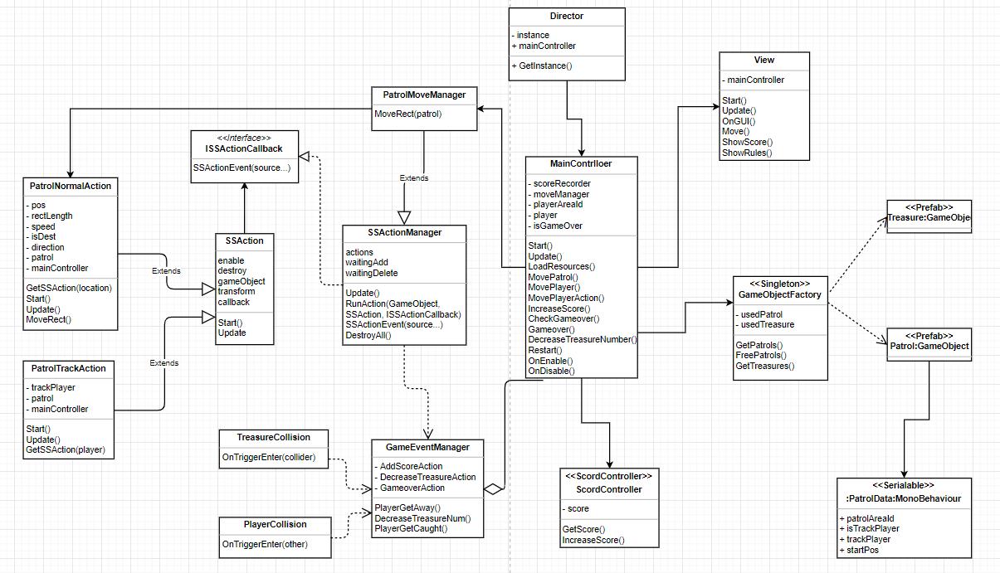

#### 单实例模板类

首先应该导入参考资源`Singleton`模板类：

```C#
public class Singleton<T> : MonoBehaviour where T : MonoBehaviour {
	protected static T instance;

	public static T Instance {
		get {
			if (instance == null) {
				instance = (T)FindObjectOfType (typeof(T));
				if (instance == null) {
					Debug.LogError ("An instance of " + typeof(T) +
					" is needed in the scene, but there is none.");
				}
			}
			return instance;
		}
	}
}
```

这个单实例模板类用来获得游戏场景中唯一的实例，用来保证工厂等对象在游戏场景中的唯一性。

#### 创建游戏预制

游戏对象预制可以从Unity3D的资源商店导入，地图和宝箱用到的资源是`HighQualityBricks&Walls`和`Pup Up Productions`，玩家对象用到的资源是`RPGHero`，巡逻兵用到的资源是`ToonyTinyPeople`，将导入资源的预制放到`Resource/Prefabs`目录下，接着为玩家对象和巡逻兵对象创建AnimatorController。

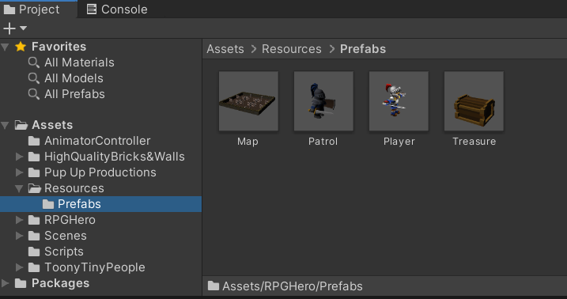

玩家对象的AnimatorController：

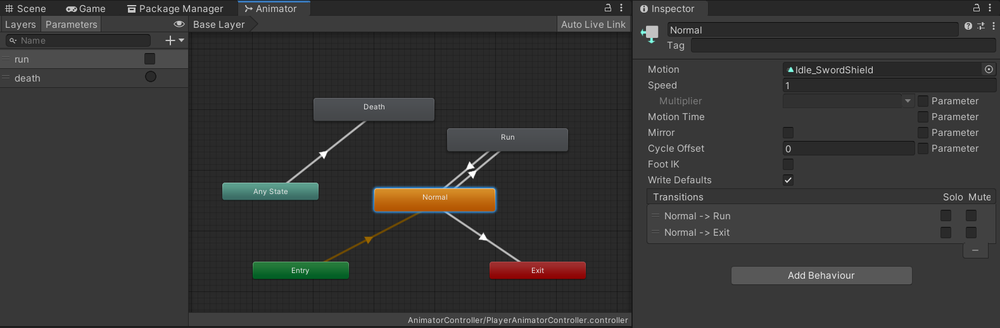

将玩家对象的普通状态动画放到`Normal`状态中，跑步动画放到`Run`状态中，`Die`动画放到`Death`状态中，在`Normal`状态到`Run`状态的箭头处设置`bool`类型`run`参数，为真则从`Normal`状态到`Run`状态，为假则从`Run`状态到`Normal`状态，在`Any State`状态到`Death`状态的箭头处设置`trigger`类型`death`参数。

巡逻兵对象的AnimatorController：

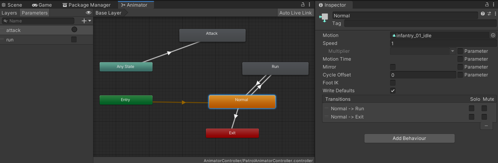

将巡逻兵对象的普通状态动画放到`Normal`状态中，跑步动画放到`Run`状态中，攻击动画放到`Attack`状态中，在`Normal`状态到`Run`状态的箭头处设置`bool`类型`run`参数，为真则从`Normal`状态到`Run`状态，为假则从`Run`状态到`Normal`状态，在`Any State`状态到`Attack`状态的箭头处设置`trigger`类型`attack`参数。

#### 游戏对象创建部分

游戏对象的创建由图中的这一部分完成，按照要求使用工厂模式创建巡逻兵和宝箱：

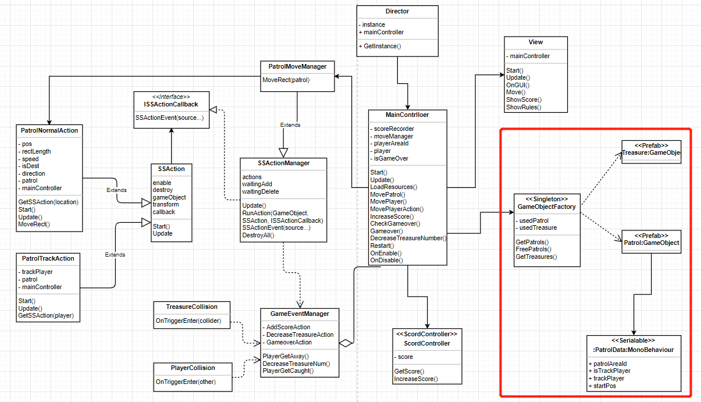

**GameObjectFactory.cs：**

游戏对象工厂类负责创建巡逻兵和宝箱，其在场景中是单实例的，且使用了对象池，实现了缓存功能，由于游戏中巡逻兵的数量不变，宝箱的数量也只会减少，所以回收方法中只有使巡逻兵停止移动的方法，实现如下：

```C#
public class GameObjectFactory : MonoBehaviour {
    private List<GameObject> usedPatrol = new List<GameObject>();  // 正在被使用的巡逻兵对象
    private List<GameObject> usedTreasure = new List<GameObject>();  // 正在被使用的水晶对象

    // 巡逻兵获取方法
    public List<GameObject> GetPatrols() {
        // 巡逻兵游戏对象
        GameObject patrolPrefab = GameObject.Instantiate(Resources.Load<GameObject>("Prefabs/Patrol"), Vector3.zero, Quaternion.identity);
        patrolPrefab.SetActive(false);
        float[] posX = { -5.5f, 4.5f, 12.5f };
        float[] posZ = { -4.5f, 5.5f, -12.5f };
        // 生成巡逻兵的初始位置
        for (int i = 0; i < 3; ++i) {
            for (int j = 0; j < 3; ++j) {
                Vector3 startPos = new Vector3(posX[i], 0, posZ[j]);
                GameObject patrol = GameObject.Instantiate(patrolPrefab, startPos, Quaternion.identity);
                patrol.SetActive(true);
                patrol.GetComponent<PatrolData>().patrolAreaId = i * 3 + j + 1;
                patrol.GetComponent<PatrolData>().startPos = startPos;
                usedPatrol.Add(patrol);
            }
        }
        return usedPatrol;
    }

    // 巡逻兵回收方法
    public void FreePatrols() {
        // 巡逻兵停止
        for (int i = 0; i < usedPatrol.Count; ++i) {
            usedPatrol[i].gameObject.GetComponent<Animator>().SetBool("run", false);
        }
    }

    // 水晶获取方法
    public List<GameObject> GetTreasures() {
        // 水晶游戏对象
        GameObject treasurePrefab = GameObject.Instantiate(Resources.Load<GameObject>("Prefabs/Treasure"), Vector3.zero, Quaternion.identity);
        treasurePrefab.SetActive(false);
        for (int i = 0; i < Director.GetInstance().mainController.GetTreasureNumber(); ++i) {
            int xIndex = Random.Range(0, 24) - 12;
            int zIndex = Random.Range(0, 24) - 12;
            GameObject treasure = GameObject.Instantiate(treasurePrefab, new Vector3(xIndex, 0, zIndex), Quaternion.identity);
            treasure.SetActive(true);
            usedTreasure.Add(treasure);
        }
        return usedTreasure;
    }
}
```

**PatrolData.cs：**

`PatrolData`是巡逻兵的模型，包含了巡逻兵相应的数据：

```C#
public class PatrolData : MonoBehaviour {
    public int patrolAreaId;  // 巡逻兵所在区域序号
    public bool isTrackPlayer = false;  // 是否跟随玩家
    public GameObject trackPlayer;  // 追踪的玩家对象
    public Vector3 startPos;  // 巡逻兵初始位置     
}
```

这样就使用工厂方法 + 单实例 + 对象池完成了巡逻兵和宝箱的创建，实现要求。

#### 记分管理类

**ScoreRecorder.cs：**

记分类中有一个分数成员变量，一个获取方法和一个加分方法：

```C#
public class ScoreController : MonoBehaviour {
    private int score = 0;  // 分数

    public int GetScore() {
        return score;
    }

    public void IncreaseScore() {
        score++;
    }
}
```

#### 游戏对象动作部分

游戏对象的动作部分由图中的这一部分完成，利用回调方法，完成了订阅-发布模式传递消息：

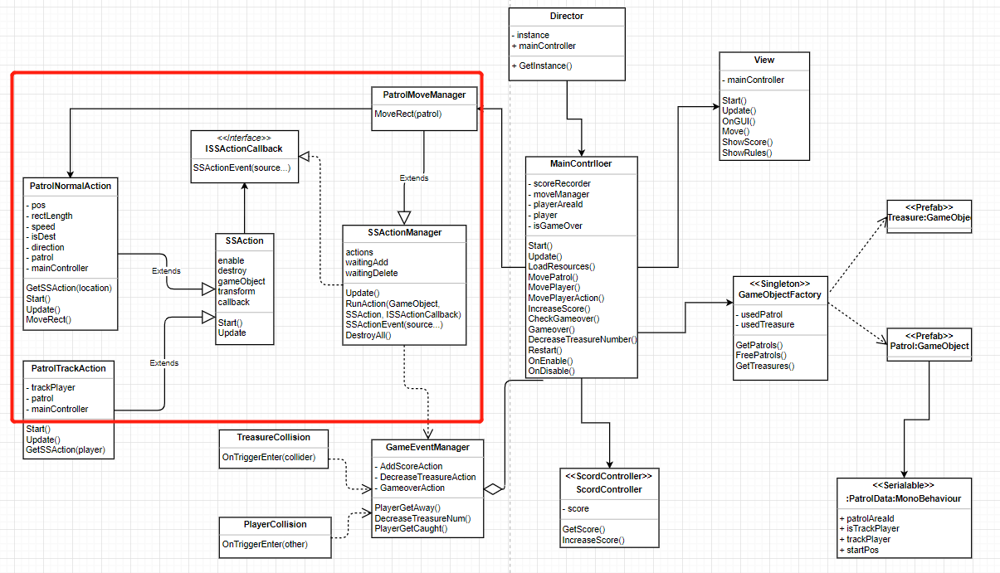

**SSAction.cs和SSActionManager.cs：**

`SSAction`是动作基类，`SSActionManager`是动作管理者的基类，其实现分别为：

```C#
public class SSAction : ScriptableObject {
    public bool enable = true;  // 动作可进行
    public bool destroy = false;  // 动作已完成可被销毁
    public GameObject gameobject { get; set; }  // 附着游戏对象
    public Transform transform { get; set; }  // 游戏对象的的运动
    public ISSActionCallback callback { get; set; }  // 回调函数

    public virtual void Start() {}  // Start()重写方法
    public virtual void Update() {}  // Update()重写方法
}

public class SSActionManager : MonoBehaviour, ISSActionCallback {
    // 动作集
    private Dictionary<int, SSAction> actions = new Dictionary<int, SSAction>();
    // 即将开始的动作的等待加入队列
    private List<SSAction> waitingAdd = new List<SSAction>();
    // 已完成的的动作的等待删除队列
    private List<int> waitingDelete = new List<int>();

    protected void Update() {
        // 载入即将开始的动作
        foreach (SSAction ac in waitingAdd) {
            actions[ac.GetInstanceID()] = ac;
        }
        // 清空等待加入队列
        waitingAdd.Clear();

        // 运行载入动作
        foreach (KeyValuePair<int, SSAction> kv in actions) {
            SSAction ac = kv.Value;
            if (ac.destroy) {
                waitingDelete.Add(ac.GetInstanceID());
            }
            else if (ac.enable) {
                ac.Update();
            }
        }

        // 清空已完成的动作
        foreach (int key in waitingDelete) {
            SSAction ac = actions[key];
            actions.Remove(key);
            Object.Destroy(ac);
        }
        // 清空等待删除队列
        waitingDelete.Clear();
    }

    // 初始化动作并加入到等待加入队列
    public void RunAction(GameObject gameobject, SSAction action, ISSActionCallback manager)
    {
        action.gameobject = gameobject;
        action.transform = gameobject.transform;
        action.callback = manager;
        waitingAdd.Add(action);
        action.Start();
    }

    // 巡逻兵正常巡逻或追踪玩家行为结束后的回调方法
    public void SSActionEvent(SSAction source,
        SSActionEventType events = SSActionEventType.Competed,
        int intParam = 0,
        string strParam = null,
        GameObject objectParam = null)
    {
        // 如果消息的回调参数为1，追踪行为结束，开始正常巡逻
        if(intParam == 1) {
            // 继续巡逻
            PatrolNormalAction move = PatrolNormalAction.GetSSAction(objectParam.gameObject.GetComponent<PatrolData>().startPos);
            this.RunAction(objectParam, move, this);
            // 玩家逃脱消息
            Singleton<GameEventManager>.Instance.PlayerGetAway();
        }
        // 如果消息的回调参数为0，正常巡逻结束，开始追踪玩家
        else {
            // 追踪玩家
            PatrolTrackAction trackAction = PatrolTrackAction.GetSSAction(objectParam.gameObject.GetComponent<PatrolData>().trackPlayer);
            this.RunAction(objectParam, trackAction, this);
        }
    }

    // 清除所有动作
    public void DestroyAll() {
        foreach (KeyValuePair<int, SSAction> kv in actions) {
            SSAction ac = kv.Value;
            ac.destroy = true;
        }
    }
}
```

**ISSActionCallback.cs：**

`ISSActionCallback`是巡逻兵正常巡逻或追踪玩家行为结束后的回调接口，当巡逻兵由正常巡逻转为追踪玩家，或由追踪玩家转为正常巡逻，就会调用这个接口里的`SSActionEvent`方法，开始新的行为和消息操作，由`SSActionManager`这个类继承：

```C#
public enum SSActionEventType : int { Started, Competed }
public interface ISSActionCallback {
    // 回调函数
    void SSActionEvent(SSAction source,
        SSActionEventType events = SSActionEventType.Competed,
        int intParam = 0,
        string strParam = null,
        Object objectParam = null);
}
```

**PatrolNormalAction.cs：**

`PatrolNormalAction`是巡逻兵的普通巡逻方法，巡逻兵按照一个矩形进行移动，如果玩家进入巡逻兵的感知范围，那么会发送普通巡逻行为结束消息：

```C#
public class PatrolNormalAction : SSAction {
    private Vector3 pos;  // 巡逻兵位置
    private float rectLength;  // 矩形长度
    public float speed = 1f;  // 移动速度
    private bool isDest;  // 是否每个方向的终点
    private int direction;  // 巡逻兵的移动方向
    private PatrolData patrol;  // 巡逻兵数据
    private MainController mainController;

    private const int EAST = 0;
    private const int NORTH = 1;
    private const int WEST = 2;
    private const int SOUTH = 3;
    
    // 获取动作
    public static PatrolNormalAction GetSSAction(Vector3 location) {
        PatrolNormalAction action = CreateInstance<PatrolNormalAction>();
        action.pos = new Vector3(location.x, 0, location.z);
        // 设定矩形边长
        action.rectLength = Random.Range(4, 8);
        return action;
    }

    public override void Start() {
        this.gameobject.GetComponent<Animator>().SetBool("run", true);
        patrol = this.gameobject.GetComponent<PatrolData>();
        mainController = Director.GetInstance().mainController;
        isDest = true;
        direction = EAST;
    }

    public override void Update() {
        // 巡逻兵按矩形移动
        MoveRect();
        // 如果巡逻兵和玩家在同一区域并在巡逻兵感知范围内，那么开始追踪
        if (mainController.GetPlayerAreaId() == patrol.patrolAreaId && patrol.isTrackPlayer) {
            this.destroy = true;
            this.callback.SSActionEvent(this, SSActionEventType.Competed, 0, null, this.gameobject);
        }
    }

    void MoveRect() {
        float newPosX = pos.x;
        float newPosZ = pos.z;
        if (isDest) {
            // 设定每个方向的新的移动终点
            switch (direction) {
                case EAST:
                    newPosX -= rectLength;
                    break;
                case NORTH:
                    newPosZ += rectLength;
                    break;
                case WEST:
                    newPosX += rectLength;
                    break;
                case SOUTH:
                    newPosZ -= rectLength;
                    break;
            }
            isDest = false;
        }
        Vector3 newPos = new Vector3(newPosX, 0, newPosZ);
        this.transform.LookAt(newPos);
        float distance = Vector3.Distance(transform.position, newPos);
        // 沿着方向直走
        if (distance > 1) {
            transform.position = Vector3.MoveTowards(this.transform.position, newPos, speed * Time.deltaTime);
        }
        // 在转弯处改变方向
        else {
            direction = (direction + 1) % 4;
            isDest = true;
        }
        // 设定新的位置
        pos.x = newPosX;
        pos.z = newPosZ;
    }
}
```

**PatrolTrackAction.cs：**

`PatrolTrackAction`是巡逻兵的追踪方法，当玩家进入巡逻兵的感知范围内时，巡逻兵会使用这一方法，开始追踪玩家，如果玩家走出了巡逻兵的感知范围，则会发送追踪行为结束消息：

```C#
public class PatrolTrackAction : SSAction {
    private GameObject trackPlayer;  // 追踪的玩家
    private PatrolData patrol;  // 巡逻兵
    private MainController mainController;

    public override void Start() {
        patrol = this.gameobject.GetComponent<PatrolData>();
        mainController = Director.GetInstance().mainController;
    }

    public override void Update() {
        // 朝玩家方向走
        transform.position = Vector3.MoveTowards(this.transform.position, trackPlayer.transform.position, 2 * Time.deltaTime);
        this.transform.LookAt(trackPlayer.transform.position);

        // 如果玩家和巡逻兵不在同一个区域，或巡逻兵没有感知到玩家
        if (mainController.GetPlayerAreaId() != patrol.patrolAreaId || !patrol.isTrackPlayer) {
            // 发送追踪行为结束消息
            this.destroy = true;
            this.callback.SSActionEvent(this, SSActionEventType.Competed, 1, null, this.gameobject);
        }
    }

    // 获取动作
    public static PatrolTrackAction GetSSAction(GameObject player) {
        PatrolTrackAction action = CreateInstance<PatrolTrackAction>();
        action.trackPlayer = player;
        return action;
    }
}
```

**PatrolMoveManager.cs：**

`PatrolMoveManager`是巡逻兵的移动方法管理器，里面有一个按照矩形移动的方法：

```C#
public class PatrolMoveManager : SSActionManager {
    // 按照矩形移动
    public void MoveRect(GameObject patrol) {
        PatrolNormalAction moveRect = PatrolNormalAction.GetSSAction(patrol.transform.position);
        this.RunAction(patrol, moveRect, this);
    }
}
```

#### 游戏事件处理部分

游戏事件的处理由图中的这一部分，以及为游戏对象编写的脚本所完成，使用订阅与发布模式传递消息：

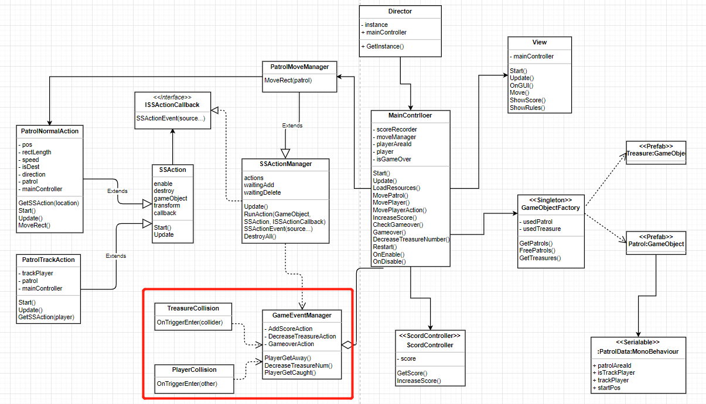

**GameEventManager.cs：**

`GameEventManager`是处理游戏事件的代理模型，有三个事件的代理，分别是增加分数，减少宝箱和游戏结束：

```C#
public class GameEventManager : MonoBehaviour {
    // 增加分数
    public delegate void AddScoreEvent();
    public static event AddScoreEvent AddScoreAction;
    // 减少宝箱
    public delegate void DecreaseTreasureEvent();
    public static event DecreaseTreasureEvent DecreaseTreasureAction;
    // 游戏结束
    public delegate void GameoverEvent();
    public static event GameoverEvent GameoverAction;

    // 玩家逃脱
    public void PlayerGetAway() {
        if (AddScoreAction != null) {
            AddScoreAction();
        }
    }

    // 减少宝箱数量
    public void DecreaseTreasureNum() {
        if (DecreaseTreasureAction != null) {
            DecreaseTreasureAction();
        }
    }

    // 玩家被抓到了
    public void PlayerGetCaught() {
        if (GameoverAction != null) {
            GameoverAction();
        }
    }
}
```

**TreasureCollision.cs：**

`TreasureCollision`是宝箱的碰撞的脚本，当玩家碰撞到宝箱时，宝箱会从图中消失，并发送减少宝箱数量的消息：

```C#
public class TreasureCollision : MonoBehaviour {
    void OnTriggerEnter(Collider collider) {
        // 如果是玩家碰到还在显示中的宝箱
        if (collider.gameObject.tag == "Player" && this.gameObject.activeSelf) {
            this.gameObject.SetActive(false);
            // 减少宝箱数量
            Singleton<GameEventManager>.Instance.DecreaseTreasureNum();
        }
    }
}
```

**PlayerCollision.cs：**

`PlayerCollision`是巡逻兵与玩家碰撞的处理脚本，当巡逻兵感知到与其发生碰撞的对象是玩家，那么调整玩家状态，触发玩家被抓事件，如果碰撞是墙，那么根据刚体性质，改换方向移动：

```C#
public class PlayerCollision : MonoBehaviour {
    void OnCollisionEnter(Collision collider) {
        // 当和巡逻兵相撞的是玩家，那么调整玩家状态，触发玩家被抓事件，如果碰撞是墙，那么改换方向移动
        if (collider.gameObject.tag == "Player") {
            collider.gameObject.GetComponent<Animator>().SetTrigger("death");
            this.GetComponent<Animator>().SetTrigger("attack");
            Singleton<GameEventManager>.Instance.PlayerGetCaught();
        }
    }
}
```

**AreaTrigger.cs：**

`AreaTrigger`是地图中每个区域的触发脚本，地图一共被分割成9个区域，每个区域有一个巡逻兵，当玩家进入某个区域时，区域会感知到玩家，并记录玩家进入区域的序号：

```C#
public class AreaTrigger : MonoBehaviour {
    public int areaId;  // 区域序号
    MainController mainController;
    private void Start() {
        mainController = Director.GetInstance().mainController as MainController;
    }

    void OnTriggerEnter(Collider collider) {
        // 记录玩家进入区域的序号
        if (collider.gameObject.tag == "Player") {
            mainController.SetPlayerAreaId(areaId);
        }
    }
}
```

**PatrolTrigger.cs：**

`PatrolTrigger`是巡逻兵的触发脚本，当玩家进入或退出巡逻兵的感知范围使，设置巡逻兵追踪玩家的状态和追踪玩家的对象：

```C#
public class PatrolTrigger : MonoBehaviour {
    void OnTriggerEnter(Collider collider) {
        // 如果玩家进入巡逻兵感知范围
        if (collider.gameObject.tag == "Player") {
            // 设置巡逻兵正在追踪玩家，设置追踪的玩家对象
            this.gameObject.transform.parent.GetComponent<PatrolData>().isTrackPlayer = true;
            this.gameObject.transform.parent.GetComponent<PatrolData>().trackPlayer = collider.gameObject;
        }
    }

    void OnTriggerExit(Collider collider) {
        // 如果玩家退出巡逻兵感知范围
        if (collider.gameObject.tag == "Player") {
            // 设置巡逻兵不在追踪玩家，设置追踪的玩家对象为空
            this.gameObject.transform.parent.GetComponent<PatrolData>().isTrackPlayer = false;
            this.gameObject.transform.parent.GetComponent<PatrolData>().trackPlayer = null;
        }
    }
}
```

#### 主控制类和视图部分

最后实现图中控制回合控制器的主控制器及其控制的视图部分：

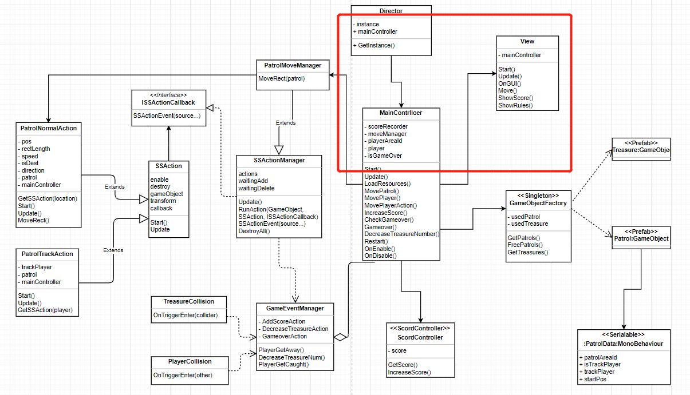

**MainController.cs：**

主控制类`MainController`的代码如下：

```C#
public class MainController : MonoBehaviour {
    private ScoreController scoreRecorder;  // 记分器
    private PatrolMoveManager moveManager;  // 移动管理器
    private int playerAreaId;  // 玩家所处区域序号
    private GameObject player;  // 玩家对象
    public Camera mainCamera;  // 主相机
    public int treasureNumber = 10;  // 宝箱数量
    public float moveSpeed = 5;  // 移动速度
    public float rotateSpeed = 135f;  // 旋转速度
    private bool isGameOver;  // 游戏是否结束
    
    void Start() {
        Director director = Director.GetInstance();
        director.mainController = this;
        scoreRecorder = gameObject.AddComponent<ScoreController>() as ScoreController;
        moveManager = gameObject.AddComponent<PatrolMoveManager>() as PatrolMoveManager;
        LoadResources();
        mainCamera.GetComponent<CameraFollow>().follow = player;
        isGameOver = false;
    }

    void Update() {
        CheckGameOver();
    }

    // 加载资源
    public void LoadResources() {
        // 生成地图
        Instantiate(Resources.Load<GameObject>("Prefabs/Map"));
        // 生成玩家
        player = Instantiate(Resources.Load("Prefabs/Player"), new Vector3(0, 9, 0), Quaternion.identity) as GameObject;
        // 生成宝箱
        Singleton<GameObjectFactory>.Instance.GetTreasures();
        // 生成巡逻兵并让其移动
        MovePatrol();
    }

    public void MovePatrol() {
        // 让所有巡逻兵都移动
        List<GameObject> patrols = Singleton<GameObjectFactory>.Instance.GetPatrols();
        for (int i = 0; i < patrols.Count; i++) {
            moveManager.MoveRect(patrols[i]);
        }
    }

    // 玩家移动
    public void MovePlayer(float translationX, float translationZ) {
        if(!isGameOver) {
            MovePlayerAction(translationX, translationZ);
            if (player.transform.position.y != 0) {
                player.transform.position = new Vector3(player.transform.position.x, 0, player.transform.position.z);
            }     
        }
    }

    // 设置玩家移动时的跑步动作
    public void MovePlayerAction(float translationX, float translationZ) {
        if (translationX != 0 || translationZ != 0) {
            player.GetComponent<Animator>().SetBool("run", true);
        }
        else {
            player.GetComponent<Animator>().SetBool("run", false);
        }
        // 移动和旋转动作
        player.transform.Translate(0, 0, translationZ * moveSpeed * Time.deltaTime);
        player.transform.Rotate(0, translationX * rotateSpeed * Time.deltaTime, 0);
    }

    public void IncreaseScore() {
        scoreRecorder.IncreaseScore();
    }

    public void CheckGameOver() {
        // 所有宝箱都被收集，游戏结束
        if(treasureNumber == 0) {
            Gameover();
        }
    }

    // 游戏结束，释放所有的巡逻兵
    public void Gameover() {
        isGameOver = true;
        Singleton<GameObjectFactory>.Instance.FreePatrols();
        moveManager.DestroyAll();
    }

    public void DecreaseTreasureNumber() {
        treasureNumber--;
    }

    public int GetScore() {
        return scoreRecorder.GetScore();
    }

    public void SetPlayerAreaId(int areaId) {
        playerAreaId = areaId;
    }

    public int GetPlayerAreaId() {
        return playerAreaId;
    }

    public int GetTreasureNumber() {
        return treasureNumber;
    }

    public bool GetGameover() {
        return isGameOver;
    }

    public void Restart() {
        SceneManager.LoadScene("Scenes/SampleSence");
    }

    void OnEnable() {
        GameEventManager.AddScoreAction += IncreaseScore;
        GameEventManager.GameoverAction += Gameover;
        GameEventManager.DecreaseTreasureAction += DecreaseTreasureNumber;
    }

    void OnDisable() {
        GameEventManager.AddScoreAction -= IncreaseScore;
        GameEventManager.GameoverAction -= Gameover;
        GameEventManager.DecreaseTreasureAction -= DecreaseTreasureNumber;
    }
}
```

**CameraFollow.cs：**

`CameraFollow`是摄像机跟随脚本，摄像机可以跟随玩家移动，提高可玩性：

```C#
public class CameraFollow : MonoBehaviour {
    public GameObject follow;  // 跟随的物体
    public float speed = 5f;  // 相机跟随物体的的速度
    Vector3 offsetPos;  // 相机和物体的相对偏移位置

    void Start() {
        offsetPos = transform.position - follow.transform.position;
    }

    void FixedUpdate() {
        Vector3 targetPos = follow.transform.position + offsetPos;
        // 摄像机平滑过渡到目标位置
        transform.position = Vector3.Lerp(transform.position, targetPos, speed * Time.deltaTime);
    }
}
```

**View.cs：**

视图类经过主控制器的控制，显示相应内容：

```C#
public class View : MonoBehaviour {
    private MainController mainController;

    void Start() {
        mainController = Director.GetInstance().mainController as MainController;
    }

    void Update() {
        Move();
    }

    void OnGUI() {
        ShowScore();
        ShowRules();
        GUIStyle textStyle = new GUIStyle();
        textStyle.fontSize = 30;
        if(mainController.GetGameover() && mainController.GetTreasureNumber() != 0) {
            GUI.Label(new Rect(Screen.width / 2 - 55, Screen.width / 2 - 250, 100, 100), "游戏结束", textStyle);
            if (GUI.Button(new Rect(Screen.width / 2 - 45, Screen.width / 2 - 170, 100, 50), "重新开始")) {
                mainController.Restart();
            }
        }
        else if(mainController.GetTreasureNumber() == 0) {
            GUI.Label(new Rect(Screen.width / 2 - 55, Screen.width / 2 - 250, 100, 100), "恭喜胜利！", textStyle);
            if (GUI.Button(new Rect(Screen.width / 2 - 45, Screen.width / 2 - 170, 100, 50), "重新开始")) {
                mainController.Restart();
            }
        }
    }

    public void Move() {
        float translationX = Input.GetAxis("Horizontal");
        float translationZ = Input.GetAxis("Vertical");
        mainController.MovePlayer(translationX, translationZ);
    }

    public void ShowScore() {
        GUIStyle scoreStyle = new GUIStyle();
        GUIStyle textStyle = new GUIStyle();
        scoreStyle.normal.textColor = Color.yellow;
        scoreStyle.fontSize = 20;
        textStyle.fontSize = 20;
        GUI.Label(new Rect(Screen.width - 100, 5, 200, 50), "分数:", textStyle);
        GUI.Label(new Rect(Screen.width - 50, 5, 200, 50), mainController.GetScore().ToString(), scoreStyle);
        GUI.Label(new Rect(10, 5, 50, 50), "剩余宝箱数:", textStyle);
        GUI.Label(new Rect(125, 5, 50, 50), mainController.GetTreasureNumber().ToString(), scoreStyle);
    }

    // 展示规则
    public void ShowRules() {
        GUIStyle ruleStyle = new GUIStyle();
        ruleStyle.fontSize = 17;
        GUI.Label(new Rect(Screen.width / 2 - 80, 10, 100, 100), "按方向键进行移动", ruleStyle);
        GUI.Label(new Rect(Screen.width / 2 - 190, 30, 100, 100), "每次甩掉一个巡逻兵计一分，与巡逻兵碰撞游戏结束", ruleStyle);
        GUI.Label(new Rect(Screen.width / 2 - 130, 50, 100, 100), "收集完所有的宝箱那么游戏获胜", ruleStyle);
    }
}
```

**Director.cs：**

导演类，返回主控制器的唯一实例：

```C#
public class Director : System.Object {
    private static Director instance;
    public MainController mainController { get; set; }
    public static Director GetInstance() {
        if (instance == null) {
            instance = new Director();
        }
        return instance;
    }
}
```

### 核心算法

在`MainController`的`MovePlayerAction`方法中，因为要模拟玩家的跑步动作，需要在普通状态和跑步状态之间切换，就需要根据位移对状态机进行判断操作，以实现跑步的效果，所编写的代码如下：

```C#
// 设置玩家移动时的跑步动作
public void MovePlayerAction(float translationX, float translationZ) {
    if (translationX != 0 || translationZ != 0) {
        player.GetComponent<Animator>().SetBool("run", true);
    }
    else {
        player.GetComponent<Animator>().SetBool("run", false);
    }
    // 移动和旋转动作
    player.transform.Translate(0, 0, translationZ * moveSpeed * Time.deltaTime);
    player.transform.Rotate(0, translationX * rotateSpeed * Time.deltaTime, 0);
}
```

在`PatrolTrackAction`的`Update`方法中，实现巡逻兵对玩家的追踪，之后如果玩家走出了巡逻兵所在或者感知区域，那么就会发送追踪行为结束消息，在代理处实现分数加一行为：

```C#
public override void Update() {
    // 朝玩家方向走
    transform.position = Vector3.MoveTowards(this.transform.position, trackPlayer.transform.position, 2 * Time.deltaTime);
    this.transform.LookAt(trackPlayer.transform.position);

    // 如果玩家和巡逻兵不在同一个区域，或巡逻兵没有感知到玩家
    if (mainController.GetPlayerAreaId() != patrol.patrolAreaId || !patrol.isTrackPlayer) {
        // 发送追踪行为结束消息
        this.destroy = true;
        this.callback.SSActionEvent(this, SSActionEventType.Competed, 1, null, this.gameobject);
    }
}
```

### 效果截图

**游戏界面：**

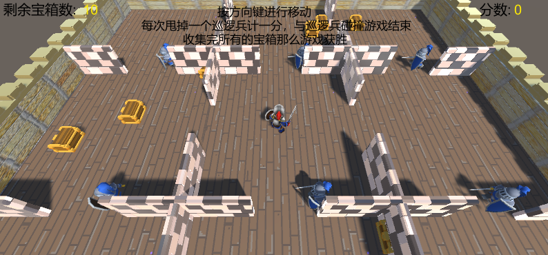

**被巡逻兵抓到，巡逻兵攻击，倒地游戏失败：**

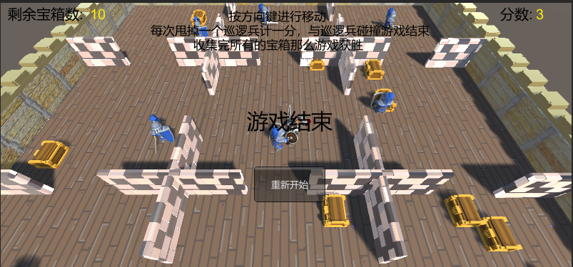

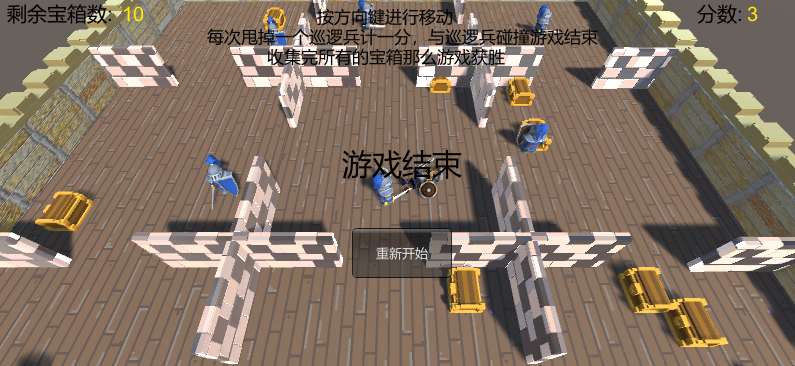

**收集完全部宝箱，游戏成功：**

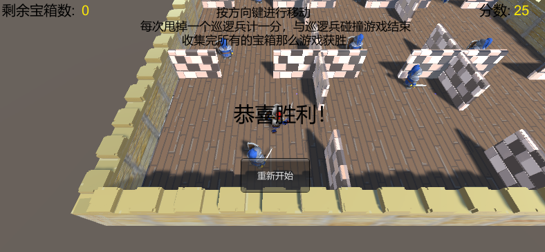

**巡逻兵偏离巡逻轨迹，开始追踪：**

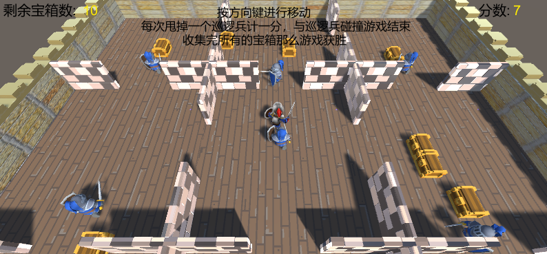
