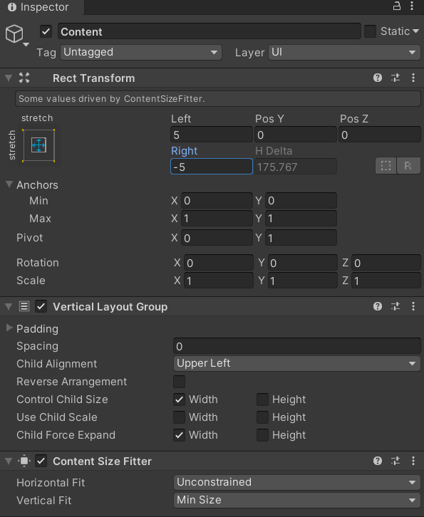

# 项目文档

## 项目基本信息

### 项目名称

可展开公告板 QuestLog

### 项目配置

#### 环境配置

+ Unity Hub版本：2.3.2
+ Unity版本：2020.1.0f1
+ Unity界面屏幕大小：710 x 389
+ 语言：C#
+ 操作系统：Win10
+ 编辑器：Visual Stdio Code

#### 项目配置过程

将`Assets`文件夹中覆盖创建的新项目的`Assets`文件夹，再点击Play按钮即可运行

#### 项目要求

+ UI 效果制作：
  + 进入 [NGUI](http://www.tasharen.com/?page_id=140) 官方网站，使用 UGUI 实现可展开 Quest Log 公告牌效果：


### 项目实现过程

1、首先创建一个Scroll View，然后给Scroll View的子元素ViewPort的子元素Content添加一个Vertical Layout Group组件，让里面的内容垂直分布，因为没有用到横向滚动的滑动条，所以可以将横向滚动的滚动条，即Scroll View的子元素Scroll View的子元素Scrollbar Horizontal删除，因为在官方网站示例的效果中，滚动条根据内容展示变化长度，所以再给Content添加一个Content Size Fitter组件，使滚动条可以自适应内容长度变化，Scroll View和Content的属性设置为：




2、然后为Content创建三个Button和三个Text子对象，每个Button的Transition要设置为None，结果如下所示：


3、然后编写按钮的点击脚本`ButtonAction`，使点击按钮后，相应的文本可以展开或收起，并把脚本挂载到按钮上，设置相应控制文本。

### 核心算法

按钮的点击脚本`ButtonAction`，应该可以实现点击后相应文本的收起或展开，所编写的代码如下：

```C#
public class ButtonAction : MonoBehaviour {
    public Text expandText;  // 要扩展的文本
    private int frame = 30;  // 帧数
    private float height = 180;  // 展开文本高度

    void Start() {
		// 为按钮设置点击事件
        Button button = this.gameObject.GetComponent<Button>();
        button.onClick.AddListener(OnClick);
		// 开始时文本收起
        StartCoroutine(Fold());
    }

	// 文本收起
    IEnumerator Fold() {
		// 获取文本底部坐标
        float textY = height;
		// 按帧收起文本
        for (int i = 0; i < frame; ++i) {
            textY -= height / frame;
            expandText.rectTransform.SetInsetAndSizeFromParentEdge(RectTransform.Edge.Right, 0, expandText.rectTransform.sizeDelta.x);
            expandText.rectTransform.SetInsetAndSizeFromParentEdge(RectTransform.Edge.Bottom, 0, textY);
            if (i == frame - 1) {
                expandText.gameObject.SetActive(false);
            }
            yield return null;
        }
    }

	// 文本展开
    IEnumerator Unfold() {
		// 获取文本底部坐标
        float textY = 0;
		// 按帧展开文本
        for (int i = 0; i < frame; ++i) {
            textY += height / frame;
            expandText.rectTransform.SetInsetAndSizeFromParentEdge(RectTransform.Edge.Right, 0, expandText.rectTransform.sizeDelta.x);
            expandText.rectTransform.SetInsetAndSizeFromParentEdge(RectTransform.Edge.Bottom, 0, textY);
            if (i == 0) {
                expandText.gameObject.SetActive(true);
            }
            yield return null;
        }
    }

	// 点击事件
    void OnClick() {
		// 如果文本在展开状态
        if (expandText.gameObject.activeSelf) {
			// 使用协程收起
            StartCoroutine(Fold());
        }
        else {
			// 使用协程展开
            StartCoroutine(Unfold());
        }
    }
}
```

### 效果截图

**开始界面：**


**点击公告栏可以展开或收起公告文本：**


**右方滚动条会随展开文本高度而变化滚动条长度：**


